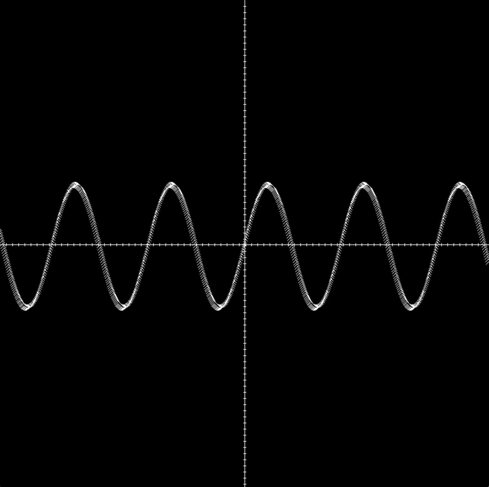
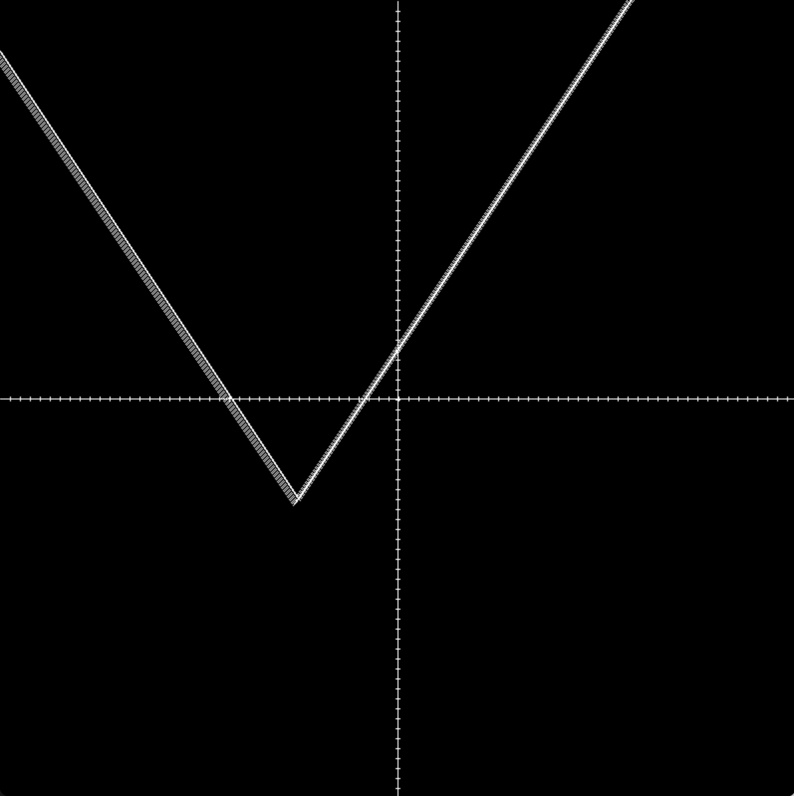
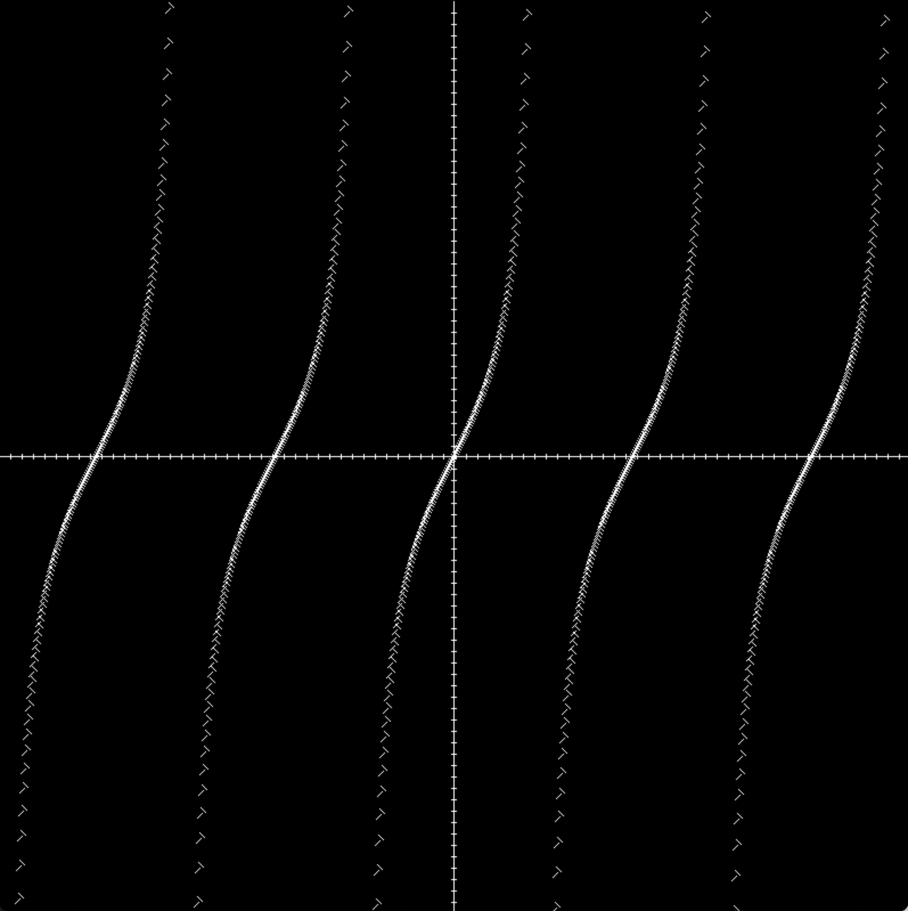
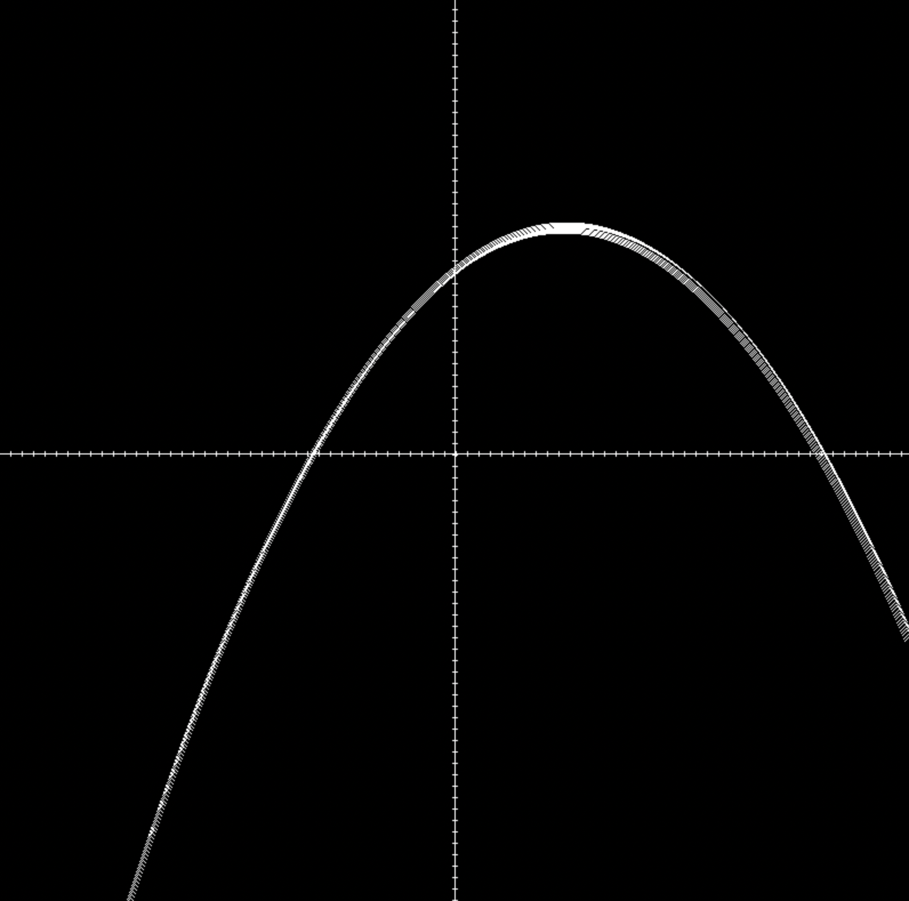

# Visual Graphing Calculator

# Overview

My purpose for this project was to practice programming in C++ and to demonstrate my object oriented programming skills. I was inspired by Desmos and it was a nice refresher on some interesting math concepts.

The Visual Graphing Calculator takes input from the user as an equation and then displays the equation on a graph. The compatible equations include linear, quadratic, absolute value, sin, and tangent.

[Software Demo Video](https://us06web.zoom.us/rec/share/TQbxlRHZlbh3cnXnR32Yl7WiIs1-0hBFCukIwdufct4IL8aFyOumgPv3XKQ8Qdr2.1NEbbDl5I8UEu2WM)

# Development Environment

I mainly used visual studio code as the IDE for this project.

The program is written entirely in C++ using the SDL2 Library to create the window.

# Useful Links

- [Girraffe Academy Youtube](https://www.youtube.com/watch?v=vLnPwxZdW4Y&t=4953s)
- [Khan Academy](https://www.khanacademy.org/math/algebra2/x2ec2f6f830c9fb89:transformations)
- [W3Schools](https://www.w3schools.com/cpp/)

# Future Work

- Separate classes into their own files
- Use polymorphism to clean up some of the code
- Add more functions for the users to play around with.
